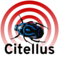

**Table of contents**
<!-- TOC depthFrom:1 insertAnchor:true orderedList:true -->

1. [What is Citellus?](#what-is-citellus)
2. [What's new?](#whats-new)
3. [Who are we?](#who-are-we)
4. [Quick glance:](#quick-glance)
5. [Code status](#code-status)
    1. [[Citellus](https://github.com/citellusorg/citellus)](#citellushttpsgithubcomcitellusorgcitellus)
    2. [[Nexus](https://github.com/citellusorg/nexus)](#nexushttpsgithubcomcitellusorgnexus)
    3. [[Citmetrics](https://github.com/citellusorg/citmetrics)](#citmetricshttpsgithubcomcitellusorgcitmetrics)
6. [Get it!](#get-it)

<!-- /TOC -->

### What is Citellus?

Is a tool based on execution of simple 'plugins' written in the language that is more convenient for you as long as it is based on some standard conventions.

It is made with several parts working together:
- Citellus: The framework running the plugins and the plugins
- Nexus: The web Interface (optional) to have a centralized server
- Citmetrics: Additional tools to receive incoming metrics from executions (that will be merged with nexus in the future)
- Additional repos containing your plugins

### What's new?
- Check the entries that we're pushing to [Citellus blog]({category}blog) or subscribe to our feed.

- Check archives at [Archives](/archives)
- Check tags in posts at [Tags](/tags)

### Who are we?

We're a group of technology enthusiasts working in different areas ranging from Consulting to Technical Support and Engineering that have come out with this tool for detecting known issues in systems to speed up the issue resolution process.

### Quick glance:

### Code status

#### [Citellus](https://github.com/citellusorg/citellus)

#### [Nexus](https://github.com/citellusorg/nexus)

#### [Citmetrics](https://github.com/citellusorg/citmetrics)

### Get it!

Just head to <https://github.com/citellusorg/citellus/> and get the code!
